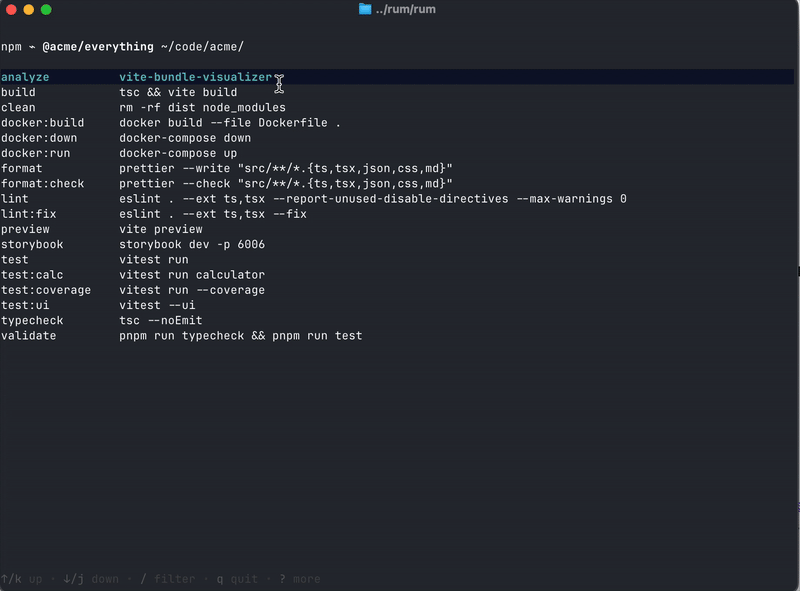

# Rum

> Is it npm test or was it pnpm test:watch?!

TUI to list, filter and run package.json scripts.

Useful in monorepos, in packages with many commands or when jumping between projects.

```sh
rum --help
TUI to list, filter and run package.json scripts.

To list the scripts in the current folder:
  rum

You can also pass relative or absolute paths either to a folder or a file:
  rum ./modules/thing/
  rum /code/project/package.json

Usage:
  rum <path to folder or package.json> [flags]
```

# Install

```sh
# If you have go https://go.dev/doc/install
go install github.com/thekarel/rum@latest

# if you have eget https://github.com/zyedidia/eget
eget thekarel/rum
```

# Gif


